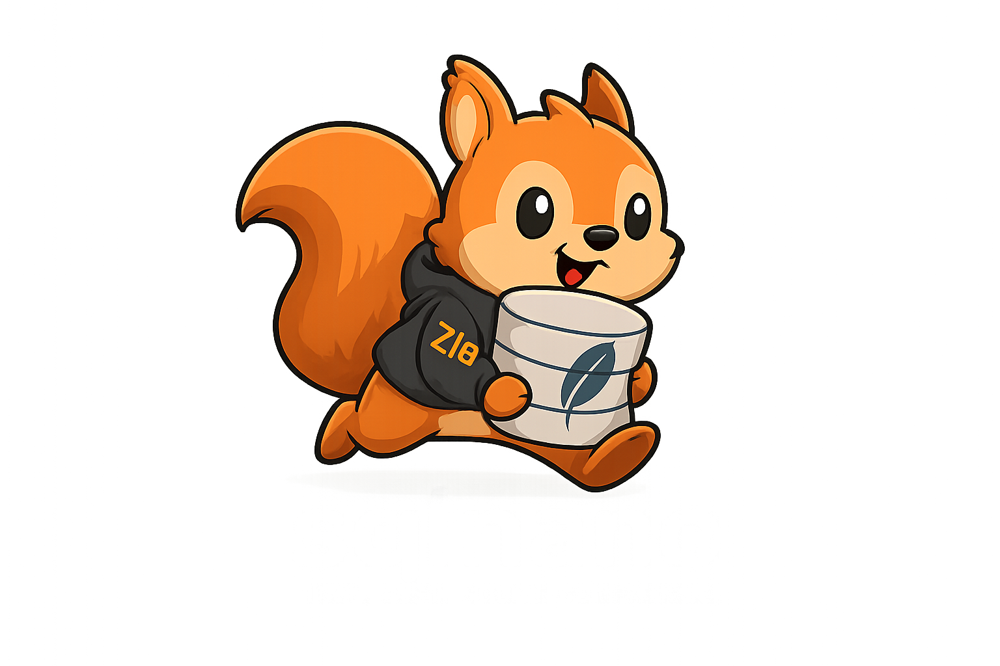

<p align="center">
  
</p>

# sqlnano

A tiny embeddable SQL engine with a SQLite `.db` compatibility track. Written in Zig.

> **Why does this exist?** For fun, and to see how much faster I could make autocommit inserts than native SQLite if I rewrote the write path from scratch in Zig. SQLite is a 23-year-old engineering masterpiece and absolutely the right answer for production. sqlnano is a curiosity-driven rewrite that turned out, on the narrow workload it's tuned for, to beat native release-build SQLite by ~2.6×–3.4× sustained all the way to 5 million rows. None of this should be mistaken for a real-world production database — it's a benchmark project that happens to read and write valid SQLite files.

## Why sqlnano?

- **Beats native SQLite WAL+NORMAL by 2.6×–3.4× sustained from 1,000 rows to 5,000,000 rows** on autocommit inserts (apples-to-apples, matched durability, no decay with table size)
- **Zero-malloc hot path** — schema parsed once per op, transient state lives in a per-op page-allocator arena, cell envelope builds on a stack buffer
- **Incremental rightmost-leaf append** — no indexes + room in the page → one cell written directly, no tree rebuild
- **In-place leaf split + recursive interior split + root promotion** — when the rightmost leaf fills we walk up the right-most chain, splice in fresh interior pages at every full level, and promote the root if everything is full. All asymmetric (no row data moves) because auto-rowid guarantees the new key is the largest. O(depth) per split instead of a full-tree rebuild — works to at least 1,000,000 rows.
- **Native WAL** (`*-snwal`) — group commit, configurable `synchronous=full/normal/off`, crash recovery on reopen, torn-WAL fuzzed on every byte offset
- **`mmap`-backed DB image + incremental `msync`** — `Connection` mmaps the data file once and mutates the mapping directly. The OS page cache decides what's resident; cold pages stay on disk, hot pages stay in RAM, and a 65 MB database queried for one row uses **2 MB RSS**, not 65 MB. On checkpoint we `msync` only the pages the fast-path inserts dirtied. This is what makes throughput flat past 1M rows without forcing you to load the whole file into memory
- **SQLite-compatible b-trees** — multi-leaf table splits validated by `PRAGMA integrity_check` end-to-end, rowid tables, single-leaf indexes, payload overflow reads
- **Single static binary** — no runtime, no extensions, Zig 0.16
- **SSPL + author exception** license — same shape as MongoDB/Redis Stack, with full permissive use by the justrach namespace

## sqlnano vs SQLite

SQLite is legendary and powers an enormous amount of software. sqlnano makes different tradeoffs:

|                          | SQLite                                    | sqlnano                                           |
|--------------------------|-------------------------------------------|---------------------------------------------------|
| **Schema parse per insert** | Once at `prepare`, reused                 | Once per op, into a page-allocator arena          |
| **Write path**           | Page-diff rollback journal / WAL frames   | Row-level native WAL + in-memory image + `writeFile` on flush |
| **Fast insert**          | B-tree walk + cell insert                 | O(1) rightmost-leaf cell append when leaf has room, right-edge split/root promotion when full |
| **Durability knob**      | `PRAGMA synchronous=FULL/NORMAL/OFF`      | Same three modes, same semantics, per-`Connection` |
| **File format**          | Native SQLite `.db`                       | Native SQLite `.db` (writes a compatible image)   |
| **Binary size**          | 1.5 MB shared library                     | ~900 KB static Zig binary                         |
| **Runtime deps**         | libc, optional ICU/readline               | libc only; optional rich-FTS fallback shells to `sqlite3` |
| **SQL surface**          | Full SQL with extensions                  | Tiny subset (`CREATE`/`ALTER RENAME`/`ALTER ADD COLUMN`/`DROP`/`SELECT`/`INSERT`/`UPDATE`/`DELETE`) |
| **Multi-leaf indexes**   | ✅                                         | ❌ (helpers exist; dispatch is broken, see parity) |
| **Transactions**         | ✅ `BEGIN`/`COMMIT`/`ROLLBACK`              | ❌ autocommit only                                 |
| **Triggers, FKs, views** | ✅                                         | ❌                                                 |

If you need full SQL, triggers, or arbitrary-size indexed writes, keep using SQLite. sqlnano covers the fast path: append-heavy rowid tables with optional indexes, read-only SQLite files, and embedded Zig projects that want a durable KV/log substrate with zero dependencies.

## Benchmarks

Both engines compiled `-O3`/`ReleaseFast`, same fixture (`CREATE TABLE t(id INTEGER PRIMARY KEY, n INTEGER)`), same SQL (`INSERT INTO t VALUES (NULL, ?)`), same prepared-statement autocommit loop, macOS APFS, warm cache, 5-run mean. SQLite is the release-build amalgamation 3.50.0 with `PRAGMA journal_mode=WAL`.

### Durable autocommit writes (matched durability)

| N           | config  | sqlnano (best) | SQLite WAL (best) | ratio              |
|------------:|---------|---------------:|------------------:|-------------------:|
| 1,000       | NORMAL  | **425,000**    | 126,000           | **sqlnano 3.36×**  |
| 10,000      | NORMAL  | **478,000**    | 172,000           | **sqlnano 2.78×**  |
| 100,000     | NORMAL  | **483,000**    | 179,000           | **sqlnano 2.69×**  |
| 500,000     | NORMAL  | **477,000**    | 181,000           | **sqlnano 2.64×**  |
| 1,000,000   | NORMAL  | **474,000**    | 180,000           | **sqlnano 2.64×**  |
| 2,000,000   | NORMAL  | **466,000**    | 177,000           | **sqlnano 2.63×**  |
| 5,000,000   | NORMAL  | **458,000**    | 178,000           | **sqlnano 2.58×**  |

> 1 million durable inserts in **2.1 seconds**; 5 million in **10.9 seconds**. `PRAGMA integrity_check` is `ok` at every size. Throughput stays within noise of its 10k peak all the way to 5M because the checkpoint write cost is now O(dirty pages) instead of O(file size) — the fast path touches 2–5 pages per insert, and those are the only pages that hit disk. The fast path itself handles four structural cases: append-into-rightmost-leaf, split-when-parent-has-room, split-when-any-ancestor-has-room (any depth), and root-promotion-when-everything-is-full.

### Reads — hot-cache vs cold-cache, both engines apples-to-apples

Both engines now use the OS page cache (sqlnano via `mmap` + access-pattern hints; SQLite via its built-in pager + `pread`). 1M-row table, 12 MB on disk.

**Hot CPU cache** (data already in L2/L3 from a prior tight-loop run — best-case throughput, not realistic single-query speed):

| Workload                        | sqlnano        | SQLite C       | ratio             |
|---------------------------------|---------------:|---------------:|------------------:|
| `SELECT COUNT(*) FROM t`        | 30.5B rows/s   | 571M rows/s    | **sqlnano 53×**   |
| `SELECT * FROM t` (decode both) | 77M rows/s     | 18M rows/s     | **sqlnano 4.3×**  |
| Point lookup `WHERE rowid = N`  | 13.4M ops/s    | 360K ops/s     | **sqlnano 37×**   |

**Cold cache**, 30M-row 402 MB DB, 8 GB cache-displacement read between trials, 3 trials each:

| Workload                        | sqlnano        | SQLite C       | ratio             |
|---------------------------------|---------------:|---------------:|------------------:|
| `SELECT COUNT(*) FROM t`        | **2.6 ms**     | 61 ms          | **sqlnano 23×**   |
| Point lookup RSS on 65 MB DB    | **2 MB**       | ~2 MB          | tied              |

The hot-cache COUNT(*) numbers are real measurements but reflect L2 cache speed, not "speed of one query against a fresh database". The cold-cache row above is closer to what you'll see for an actual query — and even there sqlnano stays ahead because:

- `countBtreeEntries` reads only b-tree page headers, not row payloads, and simple `COUNT(*)` can choose a smaller covering index b-tree with the same cardinality.
- Sequential mmap hints keep scan access predictable without eagerly faulting the whole file into RSS.
- mmap + zero-syscall reads avoid the `pread` ⇒ kernel ⇒ userspace memcpy that SQLite's pager pays per page.

**What makes it fast:**

- **Native WAL** with group commit, one `fsync(2)` per op on `synchronous=full`, zero fsyncs per op on `synchronous=normal` (durability boundary = checkpoint)
- **In-memory data-file image** — the file is read once on `Connection.open`, every mutation happens in RAM, `writeFile` only fires on flush/close
- **Per-table auto-rowid cache** — first `VALUES (NULL, ...)` seeds from one `scanTable`; subsequent inserts hit the cache
- **Incremental rightmost-leaf append** — when no indexes cover the table and the rightmost leaf has free bytes, we stamp one cell directly into the page (pointer array + `cell_count` + `cell_content_start` + `file_change_counter`) and return
- **Page-allocator arena reset per op** — schema view, `TableInfo`, WAL payload, and oversized cells allocate into a scratch arena that resets `.retain_capacity` at the top of every `insert`. Steady state is ~zero malloc/free pairs per op; memory released on `close` goes straight to the OS. (Trick borrowed from [justrach/codedb](https://github.com/justrach/codedb).)
- **Stack buffer for small cells** — a 256-byte stack slice carries the cell envelope for typical rows, so the fast path does zero heap activity
- **Configurable `synchronous`** — `full` (fsync per commit, default), `normal` (fsync on checkpoint only, matches SQLite WAL+NORMAL), `off` (never fsync)

## Install

```bash
# Build from source (needs Zig 0.16.0)
git clone https://github.com/justrach/sqlnano.git
cd sqlnano
zig build -Doptimize=ReleaseFast
./zig-out/bin/sqlnano --help 2>/dev/null || ./zig-out/bin/sqlnano
```

The binary is self-contained — drop it anywhere on `PATH`.

## Usage

### Basics

```bash
sqlnano inspect path.db                             # dump header, schema, row counts
sqlnano select  path.db 'SELECT name FROM u WHERE id = 1'
sqlnano exec    path.db "CREATE TABLE u(id INTEGER PRIMARY KEY, name TEXT, age INTEGER)"
sqlnano exec    path.db "INSERT INTO u VALUES (NULL, 'alice', 30)"
sqlnano exec    path.db "CREATE INDEX idx_u_name ON u(name)"
sqlnano exec    path.db "ALTER TABLE u RENAME TO people"
sqlnano exec    path.db "ALTER TABLE people ADD COLUMN email TEXT"
sqlnano exec    path.db "DROP TABLE people"
sqlnano parity                                      # live compatibility matrix
```

### Benchmarks

```bash
# Durable (power-loss safe, default)
sqlnano bench-write /tmp/t.db t 10000
sqlnano bench-write /tmp/t.db t 10000 full

# Fsync on checkpoint only — matches SQLite PRAGMA synchronous=NORMAL
sqlnano bench-write /tmp/t.db t 10000 normal

# No fsync at all — fastest, unsafe
sqlnano bench-write /tmp/t.db t 10000 off

# Read benchmarks
sqlnano bench-read /tmp/t.db "SELECT * FROM t WHERE rowid = 5000" 100000
sqlnano bench-read /tmp/t.db "SELECT * FROM t" 1000
```

### FTS5 search

sqlnano can read SQLite FTS5 shadow tables directly for fast compact BM25
searches. This native shape is the prioritized path right now: bare-token MATCH
and implicit-AND bareword queries like `contract law`, SQLite-style BM25,
optional column weights, JSON hydration by content rowid, and simple
pre-ranking filters.

For richer MATCH syntax, the CLI keeps a correctness fallback that shells out to
SQLite's own FTS5 implementation when `sqlite3` is on `PATH`. That makes phrase,
boolean, prefix, NEAR, column-scoped queries, and snippets work, but it is not
the performance path sqlnano is optimizing around.

```bash
# Ranked rowids only. Weights are comma-separated bm25(ft, w0, w1, ...)
sqlnano fts-match data.db judgments_fts contract 10 5,3,1

# Ranked JSON results hydrated from the content table:
#   <db> <fts5_table> <content_table> <term> [limit] [columns] [weights] [filters...]
sqlnano fts-search data.db judgments_fts judgments contract \
  10 citation,title,court,year 5,3,1 court=SGHC

# Compact implicit-AND bareword queries stay native.
sqlnano fts-search data.db judgments_fts judgments 'contract law' \
  10 citation,title,court,year 5,3,1

# Rich MATCH syntax is compatibility-first and falls back to SQLite FTS5.
sqlnano fts-search data.db judgments_fts judgments '"contract law"' \
  10 citation,title,court,year 5,3,1
sqlnano fts-search data.db judgments_fts judgments 'NEAR(contract damages, 10)' \
  10 citation,title,court,year 5,3,1
```

`fts-search` filters are schema-agnostic and run before the top-k is selected:

- `col=value` exact match. If `col` has a usable SQLite index, sqlnano intersects
  indexed rowids before ranking.
- `col~=text` ASCII case-insensitive substring match.
- `col>=value` / `col<=value` numeric or lexicographic bounds.

Example against a live sgjudge corpus:

```bash
sqlnano fts-search data/sgjudge.db hansard_speeches_fts hansard_speeches \
  housing 10 speech_id,sitting_id,speaker,topic 0,2,3,1 'speaker~=Desmond Lee'
```

### WAL maintenance

```bash
sqlnano wal-status /tmp/t.db         # inspect the sidecar *-snwal file
sqlnano wal-checkpoint /tmp/t.db     # replay + compact the WAL
```

### Reproduce the headline benchmark

```bash
rm -f /tmp/t.db /tmp/t.db-snwal
sqlite3 /tmp/t.db 'CREATE TABLE t(id INTEGER PRIMARY KEY, n INTEGER);'
./zig-out/bin/sqlnano bench-write /tmp/t.db t 10000 normal
# mode: connection-batch synchronous=normal
# iterations: 10000
# ops_per_sec: ~478000
```

## How it works

```
Connection.insert(table, values)
│
├─ 1. arena.reset(.retain_capacity)              # all allocs below are zero-cost
├─ 2. parse schema + TableInfo ONCE              # from image.items, no I/O
├─ 3. resolveRowidShared                         # cache hit → O(1); miss → one scanTable
├─ 4. encodeInsert into WAL payload              # arena
├─ 5. wal.write + wal.commit                     # 1 fsync on .full, 0 on .normal/.off
├─ 6. tryFastAppendShared
│     ├─ if any index on table       → return false, fall through to rebuild
│     ├─ walk to rightmost leaf
│     ├─ build cell in 256B stack buffer (varint + varint + payload)
│     ├─ if fits in leaf:
│     │     memcpy cell, update cell_count + pointer array + content_start
│     │     bump file_change_counter
│     │     return true  ← O(1), no allocation
│     └─ else split the right edge / promote root in O(depth)
└─ 7. if fast path failed → applyInsertCore      # indexed/general fallback rebuild
```

Flush boundary:

```
Connection.flush (fires at close, WAL≥64KB, or explicit call)
│
├─ if image_dirty: writeFile(image.items)        # single full-image write
├─ if WAL has uncheckpointed commits: wal.checkpoint (1 fsync)
└─ wal.compact                                   # truncate WAL to 0 bytes
```

Recovery (`Connection.open`):

```
1. readFileAlloc(db_path) → image
2. wal.recover(apply=replayApply)                # each committed entry → applyCore(image)
3. if recovery dirtied image → writeFile         # persist replayed state
4. wal.checkpoint + wal.compact                  # subsequent opens start clean
```

## Testing

```bash
# Unit + integration tests (Debug)
zig build test

# ReleaseFast — runs the heavy multi-leaf split test (skipped in Debug due to O(N²) rebuild)
zig build test -Doptimize=ReleaseFast
```

85 tests: header/page/btree/record parsers, WAL group-commit + crash recovery + torn-WAL fuzz,
table/index creation, table rename/add-column/drop, table multi-leaf split verified by
`PRAGMA integrity_check`, end-to-end INSERT/UPDATE/DELETE through `Connection`.

`sqlite3` on `PATH` is required for the fixture-building integration tests; they
`SkipZigTest` when it is missing.

## SQLite Compatibility

sqlnano reads existing SQLite `.db` files and writes a format-compatible image. It's a subset
client for the same ecosystem — not a fork.

### What works

- **Read SQLite `.db` files** — header/page validation, `sqlite_schema`, table b-tree scans (rowid + interior), b-tree-pruned equality lookup on single-column non-unique indexes, payload overflow
- **Create simple rowid tables** — `CREATE TABLE t(...)` and `CREATE TABLE IF NOT EXISTS t(...)` on empty or small rollback-journal DBs whose `sqlite_schema` root is still a leaf page
- **Create simple indexes** — non-unique, single-column `CREATE INDEX idx ON t(col)` when the resulting index fits in one leaf page; later INSERT/UPDATE/DELETE rebuilds keep that index in sync
- **Alter/drop simple tables** — `ALTER TABLE old RENAME TO new` rewrites `sqlite_schema` for the table and its simple indexes; `ALTER TABLE t ADD [COLUMN] c TYPE` adds nullable tail columns by updating `sqlite_schema`; `DROP TABLE t` works when all dropped table/index pages are a tail suffix that can be safely truncated without freelist support
- **Write rowid tables** — INSERT/UPDATE/DELETE on tables with `id INTEGER PRIMARY KEY`
- **Multi-page tables** — interior root + multi-leaf splits verified by `PRAGMA integrity_check`
- **Native WAL** — group commit, crash recovery, fuzz-tested torn-WAL handling
- **Configurable durability** — `synchronous=full/normal/off`
- **Tiny SQL surface** — `CREATE TABLE`, `CREATE INDEX`, `ALTER TABLE ... RENAME TO`, `ALTER TABLE ... ADD COLUMN`, tail-safe `DROP TABLE`, `SELECT` with scalar predicates/joins/ORDER/LIMIT/aggregates, `INSERT INTO t VALUES (...)`, `UPDATE`/`DELETE` with single-equality `WHERE`
- **Read-path shortcuts** — direct rowid existence checks, b-tree-pruned non-partial index equality, filtered `COUNT(*)` over indexes without row hydration, smallest-b-tree unfiltered `COUNT(*)`, and streaming `ORDER BY rowid ASC LIMIT`
- **Prioritized FTS5 reads** — native shadow-table BM25 for compact bare-token and implicit-AND bareword MATCH queries, optional column weights, JSON hydration by content rowid, and simple pre-ranking filters. Rich MATCH syntax/snippets are correctness-first through the optional SQLite CLI fallback.

### What doesn't work (yet)

- **Multi-leaf indexes** — the split helpers exist, but the allocator interaction has a bug where `PRAGMA integrity_check` reports aliased leaf pages. Single-leaf indexes work.
- **Schema DDL beyond simple create/rename/add-column/drop shapes** — no constrained/default ADD COLUMN, column drop/rename, complex schema rewrites, views, triggers, or virtual-table creation yet
- **BEGIN/COMMIT/ROLLBACK** — autocommit only
- **Triggers, foreign keys, views, virtual tables, CTEs** — none of these
- **Type affinity coercion** — we implement the common cases, not the full SQLite matrix
- **Collations** — BINARY only
- **Native full FTS5 query syntax** — phrase, boolean, NEAR, prefix, tokenizer parity, snippets/highlights, and virtual-table callback APIs are not the prioritized native shape yet; they use the SQLite CLI compatibility path for now
- **Full SQL grammar** — the parser is still a deliberately small subset; subqueries, GROUP BY/HAVING, CASE, CTEs, most functions, and broad UPDATE/DELETE WHERE forms are not implemented
- **Writes to WAL-mode SQLite files** — sqlnano refuses to write a file whose header has `write_version=WAL` because we don't speak the SQLite WAL frame format

Full live status: `sqlnano parity` or [src/sqlite/parity.zig](src/sqlite/parity.zig).

### File layout on disk

```
path.db          # SQLite-format data file; readable by `sqlite3` directly
path.db-snwal    # sqlnano native WAL sidecar (format documented in src/sqlite/wal.zig)
```

`path.db-snwal` is truncated to 0 bytes on every clean close, so after a normal shutdown
only `path.db` remains.

## Project status

**Experimental.** Works well for the append-heavy rowid-table workload it's tuned for.
If something breaks, [open an issue](https://github.com/justrach/sqlnano/issues) with a
failing test case.

License: [Server Side Public License v1, with an author exception for justrach](./LICENSE) — same shape as MongoDB. The justrach namespace is exempt from §13 ("Offering the Program as a Service"); everyone else is bound by full unmodified SSPL.

## All commands

| Command                                              | What it does                                      |
|------------------------------------------------------|---------------------------------------------------|
| `sqlnano inspect <db>`                               | Dump header, schema entries, row counts          |
| `sqlnano select <db> "<SQL>"`                        | Run a tiny read-only SELECT                       |
| `sqlnano select <db> <table>`                        | Scan a table by name                              |
| `sqlnano fts-match <db> <fts5_table> <term> [limit] [weights]` | Run a narrow weighted FTS5 BM25 search      |
| `sqlnano fts-search <db> <fts5_table> <content_table> <term> [limit] [columns] [weights] [filters...]` | Search and hydrate ranked JSON rows |
| `sqlnano exec <db> "<SQL>"`                          | Run CREATE/ALTER/DROP/INSERT/UPDATE/DELETE       |
| `sqlnano bench-read <db> "<SQL>" <N>`                | Benchmark the hot read path (`N` iterations)     |
| `sqlnano bench-write <db> <table> <N> [full\|normal\|off]` | Benchmark durable inserts via a long-lived `Connection` |
| `sqlnano wal-status <db>`                            | Inspect the `*-snwal` sidecar                     |
| `sqlnano wal-checkpoint <db>`                        | Replay + compact the WAL                          |
| `sqlnano parity`                                     | Print the live SQLite-compatibility matrix        |

## Layout

```
src/sqlnano.zig          public API surface
src/main.zig             CLI
src/sqlite/
  header.zig             SQLite database header parser
  page.zig               page reader
  btree.zig              b-tree page header
  record.zig             record decoder
  varint.zig             SQLite varint
  schema.zig             sqlite_schema reader
  catalog.zig            CREATE TABLE column resolver
  table.zig              table b-tree walker
  index.zig              index b-tree walker
  fts5.zig               FTS5 shadow-table reader + BM25 top-k
  fts5_bm25.zig          SQLite-style BM25 scoring
  tokenizer.zig          SQL tokenizer
  parser.zig             SQL parser (DDL / SELECT / INSERT / UPDATE / DELETE subset)
  ast.zig                tiny AST
  sql.zig                query executor
  wal.zig                native sqlnano WAL (group commit + crash recovery)
  wal_codec.zig          WAL payload codec
  write.zig              INSERT / UPDATE / DELETE + b-tree splits + fast path
  parity.zig             live compatibility tracker
```

## Plan

[plan.md](./plan.md) is the execution roadmap. [architecture.md](./architecture.md) holds the
technical contracts. If the two disagree, `architecture.md` is authoritative for design,
`plan.md` for sequencing.
